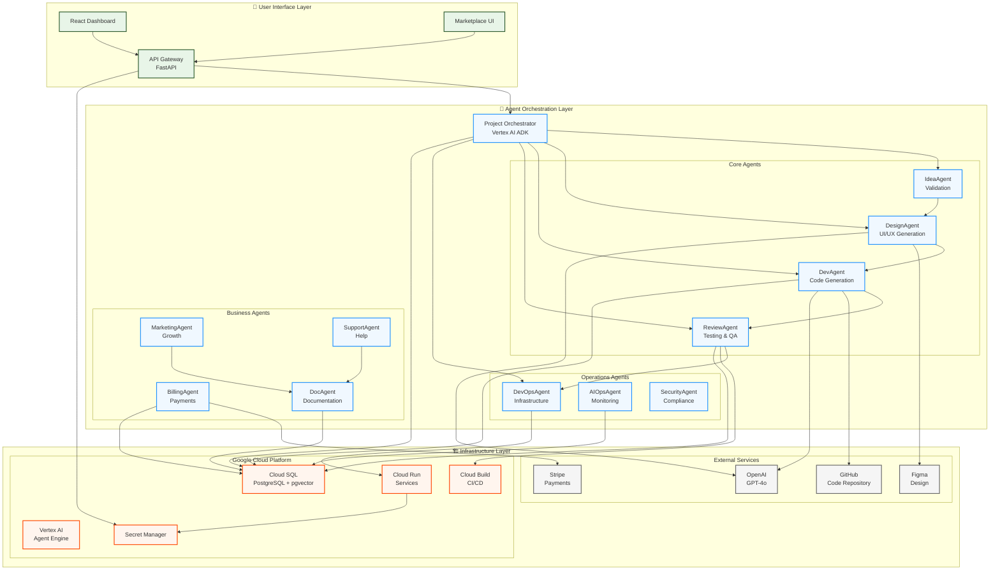

# AI SaaS Factory

> **Transform ideas into fully-deployed SaaS applications using AI-powered automation**

A sophisticated **multi-agent AI automation platform** that takes user ideas and autonomously generates, tests, and deploys production-ready SaaS applications. Built with a masterplan-driven development approach featuring 84 nightly milestones and powered by OpenAI GPT-4o and Google Gemini 2.5 Pro.

[](https://opensource.org/licenses/MIT)
[](https://www.python.org/downloads/)
[](https://reactjs.org/)
[](https://cloud.google.com/)

---

## 🎯 **What is AI SaaS Factory?**

The AI SaaS Factory is an **end-to-end automation platform** that transforms simple user ideas into fully-functional, production-ready SaaS applications. It combines multiple specialized AI agents, cloud infrastructure automation, and modern development practices to create a complete software factory.

### Key Capabilities

- **🤖 AI-Powered Code Generation** - Autonomous code writing using GPT-4o with function calling
- **🎨 Automated UI/UX Design** - Integration with Figma API for professional design generation  
- **✅ Intelligent Testing & QA** - Automated test generation and quality assurance
- **🚀 Zero-Touch Deployment** - Cloud infrastructure provisioning and application deployment
- **📊 Real-time Monitoring** - AIOps-powered anomaly detection and performance monitoring
- **💳 Built-in Business Logic** - Payment processing, user management, and analytics
- **🏢 Multi-tenant Architecture** - Scalable tenant isolation with upgrade paths

---

## 🏗️ **Architecture**



### Architecture Overview

The AI SaaS Factory uses a **three-layer architecture**:

1. **User Interface Layer** - React-based dashboard and marketplace with FastAPI gateway
2. **Agent Orchestration Layer** - Multi-agent system coordinated by Vertex AI Agent Engine
3. **Infrastructure Layer** - Google Cloud Platform services with external integrations

---

## ✨ **Features**

### 🚀 **Core Automation Pipeline**

| Stage | Agent | Capability |
|-------|--------|------------|
| **💡 Ideation** | IdeaAgent | Validates concepts, performs market research |
| **🎨 Design** | DesignAgent | Generates UI/UX designs via Figma API |
| **⚙️ Tech Stack** | TechStackAgent | Recommends optimal technology combinations |
| **💻 Development** | DevAgent | Writes production-ready code with GPT-4o |
| **✅ Quality Assurance** | ReviewAgent | Automated testing, code review, security scans |
| **🚀 Deployment** | DevOpsAgent | Infrastructure provisioning and app deployment |
| **📊 Operations** | AIOpsAgent | Real-time monitoring and anomaly detection |

### 🏢 **Business & Operational Features**

- **💳 Payment Processing** - Stripe integration with subscription management
- **👥 Multi-tenant Architecture** - Secure tenant isolation with upgrade paths
- **📈 Analytics & Reporting** - Real-time metrics and performance dashboards
- **🔒 Security & Compliance** - Automated security scans and vulnerability management
- **📚 Documentation Generation** - AI-powered documentation creation
- **🎯 Marketing Automation** - Growth optimization and user engagement

### 🎨 **UI/UX Excellence**

- **Glassmorphism Design Theme** - Modern, translucent interface design
- **Natural Olive Green Palette** - Carefully curated color scheme
- **Responsive & Accessible** - Mobile-first design with WCAG compliance
- **Real-time Updates** - WebSocket-powered live progress tracking

---

## 🚀 **Quick Start**

### Prerequisites

- **Python 3.12+** with pip
- **Node.js 18+** with npm  
- **Docker & Docker Compose**
- **Google Cloud CLI** (`gcloud`)
- **Terraform** for infrastructure

### 1. Clone & Setup

```bash
# Clone the repository (replace with your repo URL)
git clone <REPO_URL>
cd <REPO_DIR>

# Set up Python environment (requires Python 3.12)
python -m venv venv
source venv/bin/activate  # Windows: venv\Scripts\activate
pip install -r requirements-base.txt
pip install httpx  # required for tests/scripts/test_factory_pipeline.py

# Set up frontend (primary app lives in `ui/`)
cd ui && npm ci && cd ..
```

### 2. Environment Configuration

Create `.env` file:

```bash
# AI Configuration
OPENAI_API_KEY=your_openai_api_key
GOOGLE_CLOUD_PROJECT=your-gcp-project

# Database
DB_HOST=localhost
DB_NAME=factorydb
DB_USER=factory_user
DB_PASSWORD=secure_password

# External Services
STRIPE_SECRET_KEY=sk_test_your_stripe_key
GITHUB_TOKEN=ghp_your_github_token
```

### 3. Start Local Development

```bash
# Start all services
make dev-up

# Access the dashboard
open http://localhost:3000

# Access API documentation  
open http://localhost:8000/docs
```

### 4. Submit Your First Idea

1. Open the dashboard at `http://localhost:3000`
2. Click **"Submit New Idea"**
3. Describe your SaaS concept in natural language
4. Watch the agents work their magic! 🪄

---

## 📋 **Project Structure**

```
saas-factory/
├── agents/                 # AI Agent services
│   ├── dev/               # DevAgent - Code generation
│   ├── qa/                # ReviewAgent - Testing & QA  
│   ├── design/            # DesignAgent - UI/UX generation
│   ├── ops/               # AIOps & DevOps agents
│   ├── docs/              # DocAgent - Documentation
│   └── shared/            # Shared utilities & components
├── ui/                    # Primary React app (dashboard & marketplace)
├── dashboard/             # Legacy demo app (deprecated; will be merged into `ui/`)
├── api-gateway/           # FastAPI gateway with routing
├── orchestrator/          # Vertex AI orchestration layer
├── infra/                 # Terraform infrastructure modules
├── docs/                  # Documentation & guides
└── tests/                 # Comprehensive test suite
```

Note: The `ui/` app is the primary frontend. The legacy `dashboard/` folder remains for historical demos and will be consolidated into `ui/`.

---

## 🛠️ **Technology Stack**

### Backend & AI
- **Python 3.12** - Core agent implementation language
- **FastAPI** - High-performance API framework
- **PostgreSQL 15 + pgvector** - Multi-tenant database with vector storage
- **OpenAI GPT-4o** - Advanced language model for code generation
- **Google Gemini 2.5 Pro** - Multi-modal AI capabilities
- **LangGraph 0.1** - Agent workflow orchestration
- **Vertex AI Agent Engine** - Google Cloud AI orchestration

### Frontend & UX
- **React 18** - Modern frontend framework
- **TypeScript** - Type-safe JavaScript development
- **Tailwind CSS** - Utility-first styling framework
- **Vite 5** - Fast build tool and development server
- **shadcn/ui** - Beautiful, accessible component library

### Cloud & Infrastructure
- **Google Cloud Platform** - Primary cloud provider
- **Cloud Run** - Serverless container platform
- **Cloud Build** - CI/CD automation
- **Terraform** - Infrastructure as Code
- **Docker** - Containerization platform

### External Integrations
- **Stripe** - Payment processing and subscriptions
- **GitHub API** - Code repository management
- **Figma API** - Design asset generation
- **SendGrid** - Email delivery service

---

## 🎯 **Masterplan Development**

This project follows a **84-night masterplan** with structured milestones:

| Week | Focus Area | Key Deliverables |
|------|------------|------------------|
| **Week 1-2** | Foundation | GCP setup, local development, CI/CD |
| **Week 3-4** | Agent Framework | Core agents, orchestration, communication |
| **Week 5-6** | Code & Design | DevAgent, DesignAgent, QA automation |
| **Week 7-8** | DevOps & Marketplace | Infrastructure, billing, user interface |
| **Week 9-10** | Business Logic | Personalization, support, analytics |
| **Week 11-12** | Production Polish | Documentation, testing, launch preparation |

**Current Status**: ✅ Night 72 - Architecture diagrams and documentation

---

## 📊 **Usage Examples**

### Example 1: E-commerce SaaS

```bash
# User Input
"Create a multi-vendor marketplace like Etsy but for digital products"

# AI SaaS Factory Output
✅ Market analysis and competitive research
✅ Modern React storefront with payment processing  
✅ Vendor dashboard with analytics
✅ Admin panel with user management
✅ Deployed to https://your-marketplace.run.app
```

### Example 2: Business Analytics Platform

```bash
# User Input  
"Build a customer analytics dashboard for small businesses"

# AI SaaS Factory Output
✅ Data ingestion APIs and ETL pipelines
✅ Interactive charts and reporting interface
✅ Real-time metrics and alerting system
✅ Multi-tenant customer isolation
✅ Deployed with monitoring and scaling
```

---

## 🔌 **API Reference**

### Core Endpoints

```bash
# Submit new idea for processing
POST /api/ideas
{
  "title": "My SaaS Idea",
  "description": "Detailed description...",
  "target_market": "Small businesses"
}

# Get project status and progress
GET /api/projects/{project_id}/status

# Retrieve generated code and assets
GET /api/projects/{project_id}/artifacts

# Manage subscriptions and billing
POST /api/billing/subscribe
GET /api/billing/usage
```

### Agent APIs

Each agent exposes its own API:

- **DevAgent**: `http://localhost:8083/docs`
- **ReviewAgent**: `http://localhost:8084/docs`  
- **DesignAgent**: `http://localhost:8085/docs`
- **DocAgent**: `http://localhost:8089/docs`

Full API documentation available at `/docs` endpoints with interactive Swagger UI.

---

## 🧪 **Testing & Quality**

### Test Coverage

- **Unit Tests**: 80%+ coverage for all agents
- **Integration Tests**: Complete agent interaction workflows
- **E2E Tests**: Full user journey automation with Playwright
- **Security Tests**: Automated vulnerability scanning

### Running Tests

```bash
# Run all tests
make test

# Run specific agent tests
pytest tests/test_dev_agent.py -v

# Run integration tests
pytest tests/integration/ -v

# Run frontend tests
cd ui && npm test

# Generate coverage report
pytest --cov=agents tests/ --cov-report=html
```

---

## 🚀 **Deployment**

### Local Development

```bash
# Start all services
make dev-up

# Run specific agent
make run-agent AGENT=dev

# View logs
make logs
```

### Production Deployment

```bash
# Deploy to Google Cloud
cd infra/prod
terraform init
terraform plan
terraform apply

# Verify deployment
make verify-deployment
```

### Multi-Region Setup

The platform supports multi-region deployment with:

- **Primary Region**: `us-central1`
- **Backup Region**: `us-east1`
- **Blue-Green Deployments**: Zero-downtime updates
- **Automatic Failover**: Database replica promotion

---

## 🤝 **Contributing**

We welcome contributions! Please see our [Contributing Guide](docs/CONTRIBUTING.md) for detailed guidelines.

### Quick Contribution Steps

1. **Choose a Night**: Pick an unimplemented night from the [masterplan](masterplan.md)
2. **Fork & Branch**: Create feature branch with proper naming
3. **Implement & Test**: Follow coding standards with comprehensive tests
4. **Document**: Update relevant documentation
5. **Submit PR**: Use our PR template for review

### Development Workflow

- **Coding Standards**: PEP 8 for Python, ESLint for TypeScript
- **Testing Required**: All changes must include tests
- **Documentation**: Keep docs current with code changes
- **Review Process**: AI-powered code review + human approval

---

## 🔒 **Security & Privacy**

### Security Features

- **Multi-tenant Isolation** - Row-Level Security (RLS) in PostgreSQL
- **Secret Management** - Google Secret Manager integration
- **Input Validation** - Comprehensive request validation with Pydantic
- **Rate Limiting** - Protection against abuse and DoS attacks
- **Automated Scanning** - Continuous security vulnerability detection

### Privacy Compliance

- **GDPR Ready** - Data protection and user consent frameworks
- **Data Encryption** - End-to-end encryption for sensitive data
- **Audit Logging** - Comprehensive activity tracking
- **Tenant Data Isolation** - Strict separation of customer data

---

## 📈 **Performance & Scaling**

### Performance Targets

- **API Response Time**: < 200ms for standard operations
- **Agent Processing**: < 30s for complex code generation
- **UI Load Time**: < 2s initial page load
- **Database Queries**: < 100ms for most operations

### Scaling Capabilities

- **Horizontal Scaling**: Cloud Run auto-scaling up to 1000 instances
- **Database Scaling**: Cloud SQL with read replicas and connection pooling
- **Caching Strategy**: Redis for frequently accessed data
- **CDN Integration**: Global content delivery for static assets

---

## 📞 **Support & Community**

### Getting Help

- **📚 Documentation**: Comprehensive guides in `/docs` directory
- **🐛 Bug Reports**: [GitHub Issues](https://github.com/your-org/saas-factory/issues)
- **💬 Discussions**: [GitHub Discussions](https://github.com/your-org/saas-factory/discussions)
- **📧 Email**: support@saas-factory.com

### Community Resources

- **🎯 Masterplan**: [Complete development roadmap](masterplan.md)
- **🏗️ Architecture**: [System design documentation](docs/)
- **🤖 Agent Guides**: Individual agent documentation in `/agents/*/README.md`
- **🎨 UI Guidelines**: [Design system and component library](ui/README.md)

---

## 📄 **License**

This project is licensed under the **MIT License** - see the [LICENSE](LICENSE) file for details.

### Open Source Commitment

The AI SaaS Factory is committed to open source development:

- **Transparent Development** - All code and documentation publicly available
- **Community Driven** - Welcoming contributions from developers worldwide  
- **Educational Purpose** - Comprehensive learning resource for AI and cloud development
- **Commercial Friendly** - MIT license allows commercial use and modification

---

## 🎯 **Roadmap**

### Current Version: v1.0 (Nights 1-84)

✅ **Completed**: Core agent framework, multi-tenant architecture, basic marketplace  
🔄 **In Progress**: Advanced UI features, comprehensive testing, production deployment  
📋 **Next**: Performance optimization, additional integrations, mobile support

### Future Versions

- **v1.1**: Multi-cloud support (AWS, Azure)
- **v1.2**: Advanced AI models and capabilities  
- **v1.3**: Mobile app and offline capabilities
- **v2.0**: Enterprise features and compliance (HIPAA, SOC 2)

---

**🚀 Ready to transform your ideas into reality?**

[**Get Started →**](#-quick-start) | [**View Documentation →**](docs/) | [**Join Community →**](https://github.com/your-org/saas-factory/discussions)

---

*Generated by DocAgent | AI SaaS Factory v1.0 | Last updated: 2024-12-22* 