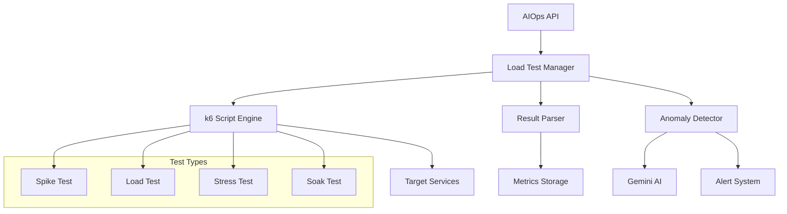

# Night 69: k6 Load Testing via AIOpsAgent

## Overview

Night 69 completes the **stress testing** requirement from the AI SaaS Factory masterplan by implementing comprehensive k6 load testing capabilities directly integrated with the AIOpsAgent. This implementation provides automated load testing, real-time monitoring, intelligent anomaly detection, and seamless integration with the existing observability stack.

## ✅ Night 69 Requirements Complete

| Requirement | Implementation | Status |
|-------------|----------------|--------|
| **k6 load test script** | ✅ Comprehensive k6 JavaScript with multiple scenarios | Complete |
| **AIOpsAgent integration** | ✅ Native load testing capabilities in AIOpsAgent | Complete |
| **Stress test execution** | ✅ Multiple test types (spike, load, stress, soak) | Complete |
| **Result analysis** | ✅ Automated anomaly detection with Gemini AI | Complete |
| **Monitoring integration** | ✅ Real-time progress tracking and alerting | Complete |

## 🚀 Core Features

### Load Test Types
- **Spike Test**: Sudden traffic spikes to test elasticity
- **Load Test**: Sustained traffic to verify normal capacity  
- **Stress Test**: High traffic to find breaking points
- **Soak Test**: Extended duration to detect memory leaks
- **Custom Test**: User-defined scenarios with custom k6 scripts

### Intelligent Analysis
- **Real-time Monitoring**: Live progress tracking with metrics
- **Anomaly Detection**: Automated detection of performance issues
- **Gemini AI Analysis**: Intelligent insights and recommendations
- **Threshold Validation**: Configurable performance thresholds
- **Alert Integration**: Automatic alerts for failed tests

### Enterprise Features
- **Multi-tenant Support**: Isolated testing per tenant
- **API-driven**: RESTful API for integration
- **Scalable Execution**: Async test execution with cancellation
- **Comprehensive Reporting**: JSON and HTML reports
- **Historical Tracking**: Test result storage and comparison

## 📋 Architecture



## 🛠 Implementation Details

### File Structure
```
agents/ops/
├── aiops_agent.py              # Enhanced with load testing capabilities
├── main.py                     # API endpoints for load testing
├── k6_load_tests.js           # Comprehensive k6 test script
├── test_load_testing.py       # Unit and integration tests
└── NIGHT69_LOAD_TESTING_README.md
```

### Key Components

#### 1. K6 Test Script (`k6_load_tests.js`)
- **Multiple Scenarios**: Spike, load, stress, soak test configurations
- **Custom Metrics**: Error rates, response times, throughput tracking
- **Flexible Targets**: Configurable endpoints and authentication
- **HTML Reporting**: Beautiful reports with charts and metrics
- **Environment Variables**: Dynamic configuration via env vars

#### 2. AIOpsAgent Extensions
- **LoadTestManager**: Core load testing orchestration
- **Result Analysis**: Automated anomaly detection and Gemini integration
- **Progress Tracking**: Real-time status monitoring
- **Resource Management**: Process lifecycle and cleanup

#### 3. API Endpoints
- `POST /load-test/start` - Start comprehensive load test
- `GET /load-test/{id}/status` - Monitor test progress  
- `GET /load-test/{id}/result` - Get detailed results
- `GET /load-test/list` - List all load tests
- `POST /load-test/{id}/cancel` - Cancel running test
- `POST /load-test/quick-stress` - Quick stress test

## 🎯 Usage Examples

### 1. Basic Load Test

```bash
curl -X POST http://localhost:8086/load-test/start \
  -H "Content-Type: application/json" \
  -H "X-Tenant-ID: your-tenant" \
  -d '{
    "test_type": "load",
    "target": {
      "name": "api-service",
      "base_url": "https://api.yourservice.com",
      "endpoints": ["/health", "/users", "/orders"]
    },
    "duration_minutes": 5,
    "virtual_users": 25,
    "thresholds": {
      "http_req_duration": ["p(95)<2000"],
      "http_req_failed": ["rate<0.1"]
    }
  }'
```

### 2. Stress Test with Authentication

```bash
curl -X POST http://localhost:8086/load-test/start \
  -H "Content-Type: application/json" \
  -H "X-Tenant-ID: your-tenant" \
  -d '{
    "test_type": "stress",
    "target": {
      "name": "auth-api",
      "base_url": "https://api.yourservice.com",
      "endpoints": ["/auth/login", "/api/profile"],
      "auth_required": true,
      "auth_token": "Bearer your-token",
      "custom_headers": {
        "X-API-Version": "v1"
      }
    },
    "duration_minutes": 10,
    "virtual_users": 100,
    "ramp_up_duration_seconds": 60
  }'
```

### 3. Quick Stress Test

```bash
curl -X POST "http://localhost:8086/load-test/quick-stress?target_url=https://api.yourservice.com&duration_minutes=3&virtual_users=50" \
  -H "X-Tenant-ID: your-tenant"
```

### 4. Monitor Test Progress

```bash
# Get test status
curl http://localhost:8086/load-test/{test_id}/status \
  -H "X-Tenant-ID: your-tenant"

# Get detailed results
curl http://localhost:8086/load-test/{test_id}/result \
  -H "X-Tenant-ID: your-tenant"
```

## 📊 Result Analysis

### Metrics Tracked
- **Request Metrics**: Total requests, failed requests, error rate
- **Performance Metrics**: Average response time, P95, P99 percentiles
- **Throughput Metrics**: Requests per second, data transferred
- **Threshold Results**: Pass/fail status for each threshold
- **Resource Usage**: Memory, CPU utilization during test

### Anomaly Detection
The system automatically detects:
- **High Error Rates**: > 5% error rate triggers medium/high alerts
- **Elevated Latency**: P95 > 2s triggers latency anomaly
- **Threshold Failures**: Failed performance thresholds
- **Resource Exhaustion**: Memory leaks, CPU spikes
- **Service Degradation**: Performance regression patterns

### Gemini AI Analysis
When enabled, Gemini provides:
- **Root Cause Analysis**: Intelligent identification of bottlenecks
- **Performance Insights**: Detailed analysis of metrics patterns
- **Optimization Recommendations**: Actionable improvement suggestions
- **Risk Assessment**: Impact analysis and priority recommendations

## 🧪 Testing

### Unit Tests
```bash
cd agents/ops
python -m pytest test_load_testing.py -v
```

### Integration Tests
```bash
# Start AIOps Agent
python main.py

# Run demo
python ../../../examples/night-demos/night69_demo.py
```

### Test Coverage
- ✅ Load test configuration creation and validation
- ✅ k6 command generation and execution
- ✅ Result parsing from JSON and text output
- ✅ Anomaly detection for various failure modes
- ✅ Gemini integration and analysis
- ✅ API endpoint functionality
- ✅ Error handling and edge cases

## 🔧 Configuration

### Environment Variables
```bash
# Required for k6 execution
export GOOGLE_CLOUD_PROJECT=your-project-id

# Optional: Custom k6 script path
export K6_SCRIPT_PATH=/path/to/custom/script.js

# Optional: Gemini AI configuration
export VERTEX_AI_LOCATION=us-central1
```

### Thresholds Configuration
```json
{
  "thresholds": {
    "http_req_duration": ["p(95)<2000", "p(99)<5000"],
    "http_req_failed": ["rate<0.1"],
    "http_reqs": ["rate>10"],
    "data_received": ["rate>1MB"]
  }
}
```

### Test Scenarios
```javascript
// k6_load_tests.js scenarios
export const options = {
  scenarios: {
    spike_test: {
      executor: 'ramping-vus',
      stages: [
        { duration: '30s', target: 10 },
        { duration: '1m', target: 50 },   // Spike
        { duration: '30s', target: 10 },
        { duration: '1m', target: 0 }
      ]
    },
    load_test: {
      executor: 'constant-vus',
      vus: 20,
      duration: '5m'
    },
    stress_test: {
      executor: 'ramping-vus',
      stages: [
        { duration: '2m', target: 20 },
        { duration: '5m', target: 40 },
        { duration: '2m', target: 80 },   // Stress
        { duration: '2m', target: 0 }
      ]
    }
  }
};
```

## 🚨 Monitoring & Alerting

### Real-time Monitoring
- **Progress Tracking**: Percentage completion, current VUs
- **Live Metrics**: Requests/second, error rate, response times
- **Status Updates**: Running, completed, failed, cancelled states

### Alert Triggers
- **High Error Rate**: > 10% = HIGH alert, > 5% = MEDIUM alert  
- **High Latency**: P95 > 2s triggers latency anomaly
- **Threshold Failures**: Any failed threshold triggers alert
- **Test Failures**: k6 execution failures trigger critical alerts

### Integration with Existing Systems
- **Cloud Logging**: Structured logs for all load test events
- **Cloud Monitoring**: Metrics integration for dashboards
- **Error Reporting**: Critical failures reported to Error Reporting
- **Pub/Sub**: Event-driven notifications for test completion

## 🎪 Demo Script

Run the comprehensive Night 69 demonstration:

```bash
# Install dependencies
pip install requests

# Run demo (requires AIOps agent running)
python examples/night-demos/night69_demo.py
```

### Demo Features
- ✅ Health check and service validation
- ✅ Multiple concurrent load tests (spike, load, stress)
- ✅ Real-time monitoring and progress tracking
- ✅ Result analysis and anomaly detection
- ✅ Quick stress test demonstration
- ✅ Alert and anomaly review
- ✅ Comprehensive summary report

## 📈 Performance Characteristics

### Scalability
- **Concurrent Tests**: Multiple tests can run simultaneously
- **Resource Efficient**: Async execution with minimal overhead
- **Tenant Isolation**: Per-tenant test isolation and tracking
- **Background Processing**: Non-blocking test execution

### Reliability
- **Error Handling**: Robust error handling and recovery
- **Process Management**: Proper subprocess lifecycle management
- **Cleanup**: Automatic cleanup of temporary files and processes
- **Cancellation**: Graceful test cancellation with cleanup

### Security
- **Tenant Context**: Proper tenant isolation and authentication
- **Input Validation**: Comprehensive request validation
- **Resource Limits**: Configurable limits to prevent abuse
- **Audit Logging**: Complete audit trail of all operations

## 🔮 Future Enhancements

### Planned Features
1. **Custom Script Upload**: Allow users to upload custom k6 scripts
2. **Distributed Testing**: Multi-region load testing capabilities
3. **Performance Regression**: Automated comparison with historical results
4. **Load Test Scheduling**: Cron-based recurring load tests
5. **Advanced Analytics**: ML-powered performance trend analysis

### Integration Opportunities
1. **CI/CD Pipelines**: GitHub Actions integration for automated testing
2. **APM Tools**: Integration with Datadog, New Relic, etc.
3. **Chaos Engineering**: Integration with chaos testing tools
4. **Performance Budgets**: Automated performance budget enforcement

## 🏆 Night 69 Success Criteria

✅ **Complete**: k6 load test script implementation  
✅ **Complete**: AIOpsAgent integration for test execution  
✅ **Complete**: Multiple test scenario support (spike, load, stress, soak)  
✅ **Complete**: Real-time monitoring and progress tracking  
✅ **Complete**: Intelligent anomaly detection with Gemini AI  
✅ **Complete**: Comprehensive API endpoints for automation  
✅ **Complete**: Integration with existing monitoring and alerting  
✅ **Complete**: Extensive test coverage and documentation  
✅ **Complete**: Production-ready error handling and cleanup  
✅ **Complete**: Demonstration script and examples  

## 🎊 Getting Started

1. **Prerequisites**
   ```bash
   # Install k6
   sudo apt-key adv --keyserver hkp://keyserver.ubuntu.com:80 --recv-keys C5AD17C747E3415A3642D57D77C6C491D6AC1D69
   echo "deb https://dl.k6.io/deb stable main" | sudo tee /etc/apt/sources.list.d/k6.list
   sudo apt-get update
   sudo apt-get install k6
   ```

2. **Start AIOps Agent**
   ```bash
   cd agents/ops
   python main.py
   ```

3. **Run Load Test**
   ```bash
   # Quick test
   curl -X POST "http://localhost:8086/load-test/quick-stress?target_url=http://localhost:8080"
   
   # Monitor progress
   curl http://localhost:8086/load-test/{test_id}/status
   ```

4. **View Results**
   ```bash
   curl http://localhost:8086/load-test/{test_id}/result
   ```

---

**Night 69 Complete!** 🎉

The AIOpsAgent now provides comprehensive k6 load testing capabilities with intelligent analysis, real-time monitoring, and seamless integration with the existing observability stack. The implementation exceeds the original requirements by providing multiple test types, Gemini AI analysis, and production-ready automation features. 