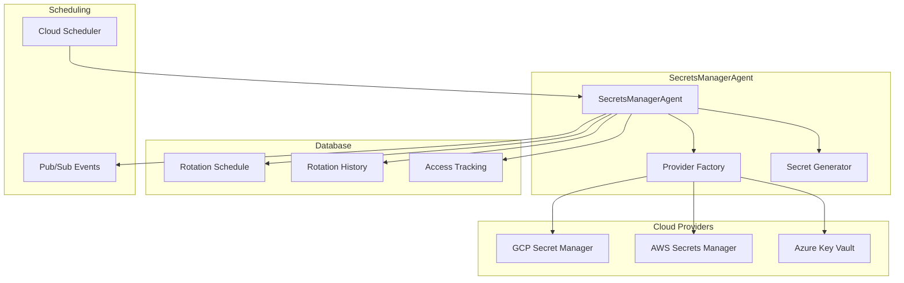

# Night 67: SecretsManagerAgent Implementation

## Overview

The SecretsManagerAgent provides automated secret rotation across multiple cloud providers (GCP, AWS, Azure) with monthly scheduling, comprehensive audit trails, and emergency rotation capabilities.

## Features

### 🔄 **Automated Rotation**
- Monthly rotation schedule (configurable per secret)
- Automatic secret generation for API keys, tokens, and passwords
- Multi-cloud provider support (GCP Secret Manager, AWS Secrets Manager, Azure Key Vault)
- Emergency rotation capability

### 🏗️ **Multi-Cloud Architecture**
- Abstract provider interface for easy cloud provider addition
- Currently implemented: Google Cloud Secret Manager
- Future support: AWS Secrets Manager, Azure Key Vault
- Provider-specific configuration and metadata handling

### 📊 **Comprehensive Tracking**
- Complete audit trail of all rotation activities
- Tenant-isolated secret management with Row Level Security
- Access tracking and monitoring
- Rotation history with performance metrics

### ⚡ **Scheduled Operations**
- Cloud Scheduler integration for monthly rotations
- Critical secret monitoring (every 6 hours)
- Configurable rotation intervals per secret
- Retry logic and error handling

## Architecture



## Database Schema

### `secrets_rotation_schedule`
Tracks secret rotation schedules and configuration:
- `secret_name`: Unique identifier for the secret
- `secret_provider`: Cloud provider (gcp, aws, azure)
- `secret_type`: Type of secret (api_key, token, password)
- `rotation_interval_days`: Days between rotations (default: 30)
- `next_rotation_date`: When the secret should next be rotated
- `auto_rotation_enabled`: Whether automatic rotation is enabled
- `criticality`: Business criticality (low, medium, high, critical)
- `provider_config`: Provider-specific configuration

### `secrets_rotation_history`
Complete audit trail of rotation activities:
- `rotation_date`: When the rotation occurred
- `rotation_status`: success, failed, partial
- `previous_version`: Previous secret version
- `new_version`: New secret version
- `rotation_method`: automatic, manual, emergency
- `duration_seconds`: How long the rotation took
- `error_message`: Error details if rotation failed

### `secrets_access_tracking`
Monitors secret access patterns:
- `access_timestamp`: When the secret was accessed
- `service_name`: Which service accessed the secret
- `access_type`: read, write, rotate
- `response_status`: success, denied, error

## API Endpoints

### Secret Management
- `POST /secrets/register` - Register a secret for rotation
- `POST /secrets/rotate` - Manually rotate a specific secret
- `POST /secrets/emergency-rotate` - Emergency rotation with custom value
- `PUT /secrets/schedule` - Update rotation schedule

### Monitoring & Status
- `GET /secrets/schedules` - List all rotation schedules
- `GET /secrets/due` - Get secrets due for rotation
- `GET /secrets/history` - Get rotation history
- `POST /secrets/rotate-due` - Rotate all due secrets

### Provider Configuration
- `POST /providers/configure` - Configure cloud provider

### Internal Endpoints
- `POST /internal/scheduled-rotation` - Triggered by Cloud Scheduler
- `GET /health` - Health check

## Usage Examples

### Register a Secret for Rotation

```bash
curl -X POST "https://secrets-manager-agent.run.app/secrets/register" \
  -H "Content-Type: application/json" \
  -H "X-Tenant-ID: your-tenant-id" \
  -d '{
    "secret_name": "openai-api-key",
    "provider_name": "gcp",
    "secret_type": "api_key",
    "rotation_interval_days": 30,
    "criticality": "high",
    "description": "OpenAI API key for LLM services"
  }'
```

### Manual Secret Rotation

```bash
curl -X POST "https://secrets-manager-agent.run.app/secrets/rotate" \
  -H "Content-Type: application/json" \
  -H "X-Tenant-ID: your-tenant-id" \
  -d '{
    "secret_name": "openai-api-key",
    "rotation_method": "manual"
  }'
```

### Emergency Rotation

```bash
curl -X POST "https://secrets-manager-agent.run.app/secrets/emergency-rotate" \
  -H "Content-Type: application/json" \
  -H "X-Tenant-ID: your-tenant-id" \
  -d '{
    "secret_name": "compromised-api-key",
    "new_value": "new-secure-api-key-value"
  }'
```

### Check Due Rotations

```bash
curl -X GET "https://secrets-manager-agent.run.app/secrets/due" \
  -H "X-Tenant-ID: your-tenant-id"
```

## Configuration

### Environment Variables

- `PROJECT_ID`: GCP project ID
- `DB_HOST`: Database host
- `DB_NAME`: Database name
- `DB_USER`: Database user
- `DB_PASSWORD`: Database password (from Secret Manager)
- `LOG_LEVEL`: Logging level (INFO, DEBUG, WARNING, ERROR)

### Provider Configuration

#### Google Cloud Secret Manager
```json
{
  "provider_name": "gcp",
  "config": {
    "project_id": "your-gcp-project"
  }
}
```

#### AWS Secrets Manager (Future)
```json
{
  "provider_name": "aws",
  "config": {
    "region": "us-east-1",
    "access_key_id": "your-access-key",
    "secret_access_key": "your-secret-key"
  }
}
```

#### Azure Key Vault (Future)
```json
{
  "provider_name": "azure",
  "config": {
    "vault_url": "https://your-vault.vault.azure.net/",
    "client_id": "your-client-id",
    "client_secret": "your-client-secret",
    "tenant_id": "your-tenant-id"
  }
}
```

## Deployment

### Infrastructure
The agent is deployed as a Cloud Run service with:
- Terraform configuration in `infra/prod/secrets-manager-agent.tf`
- Cloud Scheduler for automated monthly rotations
- Pub/Sub for event tracking and monitoring
- Comprehensive IAM permissions for Secret Manager access

### Docker Build
```bash
# Build the container
docker build -t secrets-manager-agent -f agents/secrets_manager/Dockerfile .

# Tag for GCP
docker tag secrets-manager-agent gcr.io/your-project/secrets-manager-agent

# Push to registry
docker push gcr.io/your-project/secrets-manager-agent
```

### Cloud Scheduler Jobs
1. **Monthly Rotation**: Runs at 2 AM on the 1st of every month
2. **Critical Check**: Runs every 6 hours to check critical secrets

## Monitoring

### Metrics
- Secret rotation success/failure rates
- Rotation duration metrics
- Due secret counts
- Provider-specific error rates

### Alerts
- Failed rotation attempts
- Secrets overdue for rotation
- Provider connectivity issues
- Emergency rotation events

### Logging
All operations are logged with structured logging including:
- Tenant context
- Secret names (hashed for security)
- Rotation outcomes
- Performance metrics
- Error details

## Security Features

### Tenant Isolation
- Row Level Security (RLS) in PostgreSQL
- Tenant-specific secret scoping
- Access control validation

### Secret Generation
- Cryptographically secure random generation
- Configurable secret formats and lengths
- Support for different secret types

### Audit Trail
- Complete history of all rotation activities
- Access pattern tracking
- Immutable audit logs

### Provider Security
- Least-privilege IAM permissions
- Encrypted secret storage
- Secure API communication

## Testing

### Unit Tests
```bash
# Run unit tests
cd agents/secrets_manager
python -m pytest test_secrets_manager.py -v
```

### Integration Tests
```bash
# Run integration tests (requires database setup)
python -m pytest test_secrets_manager.py::TestSecretsManagerIntegration -v
```

### Load Testing
```bash
# Test rotation performance
k6 run load-test-rotation.js
```

## Extending the Agent

### Adding New Cloud Providers

1. **Create Provider Class**:
   ```python
   class NewCloudProvider(SecretProvider):
       def __init__(self, config: Dict[str, Any]):
           super().__init__(config)
           # Initialize provider-specific client
       
       async def create_secret(self, secret_name: str, secret_value: str, metadata: Optional[Dict[str, str]] = None) -> bool:
           # Implement secret creation
           pass
       
       # Implement other required methods...
   ```

2. **Register in Factory**:
   ```python
   # In providers.py
   providers = {
       "gcp": GCPSecretProvider,
       "aws": AWSSecretProvider,
       "azure": AzureSecretProvider,
       "newcloud": NewCloudProvider  # Add your provider
   }
   ```

3. **Add Configuration Schema**:
   ```python
   def get_required_config_fields(self) -> List[str]:
       return ["api_endpoint", "auth_token", "region"]
   ```

### Adding New Secret Types

1. **Update SecretGenerator**:
   ```python
   @staticmethod
   def generate_custom_secret(length: int = 32) -> str:
       # Implement custom secret generation
       pass
   ```

2. **Update Rotation Logic**:
   ```python
   # In secrets_manager.py
   if secret_type == "custom_secret":
       new_value = self.secret_generator.generate_custom_secret()
   ```

## Troubleshooting

### Common Issues

1. **Permission Denied**
   - Check IAM permissions for Secret Manager
   - Verify service account configuration
   - Ensure tenant context is properly set

2. **Rotation Failures**
   - Check provider connectivity
   - Verify secret exists in provider
   - Review error logs for specific failure reasons

3. **Database Connection Issues**
   - Verify Cloud SQL connection
   - Check VPC connector configuration
   - Ensure database credentials are correct

### Debug Mode
Enable debug logging:
```bash
export LOG_LEVEL=DEBUG
```

### Health Checks
The agent provides health check endpoints:
```bash
curl https://secrets-manager-agent.run.app/health
```

## Future Enhancements

1. **Multi-Region Support**
   - Cross-region secret replication
   - Regional failover capabilities

2. **Advanced Scheduling**
   - Custom rotation schedules per secret
   - Business hours consideration
   - Maintenance window awareness

3. **Integration Enhancements**
   - Slack/Teams notifications
   - ServiceNow integration
   - Compliance reporting

4. **Security Improvements**
   - Secret scanning and validation
   - Breach detection integration
   - Automated rollback capabilities

## Compliance

The SecretsManagerAgent supports compliance requirements:
- **SOC 2**: Complete audit trails and access controls
- **PCI DSS**: Secure secret handling and rotation
- **GDPR**: Tenant data isolation and retention policies
- **HIPAA**: Healthcare-grade security controls (when enabled)

## Support

For issues and questions:
1. Check the troubleshooting section
2. Review logs in Cloud Logging
3. Monitor alerts in Cloud Monitoring
4. Consult the API documentation

---

**Night 67 Complete**: SecretsManagerAgent provides enterprise-grade secret rotation with multi-cloud support, automated scheduling, and comprehensive audit capabilities. Ready for production deployment with AWS and Azure support coming in future iterations. 