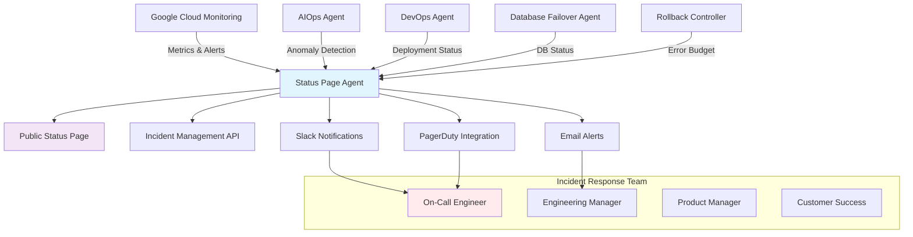

# Night 79: Incident Response Playbook & Status Page

## 🎯 Overview

This playbook provides comprehensive incident response procedures for the **SaaS Factory** platform, integrating with our automated monitoring, status page, and AI-powered operations system.

## 🏗️ Architecture Integration

### Status Page Infrastructure



## 📊 Incident Severity Levels

| Severity | Description | Response Time | Escalation | Examples |
|----------|-------------|---------------|------------|-----------|
| **P0 - Critical** | Complete service outage | < 15 minutes | Immediate | All services down, data loss |
| **P1 - High** | Major functionality impacted | < 30 minutes | Within 1 hour | Core features unavailable |
| **P2 - Medium** | Partial service degradation | < 2 hours | Within 4 hours | Performance issues, some features down |
| **P3 - Low** | Minor issues or planned maintenance | < 24 hours | Within 1 day | UI issues, non-critical bugs |

## 🚨 Incident Detection

### Automated Detection Sources

1. **Google Cloud Monitoring**
   - Uptime check failures
   - Error rate thresholds exceeded
   - Latency degradation
   - Resource exhaustion

2. **AIOps Agent Analysis**
   - Log anomaly detection
   - Performance pattern changes
   - Predictive failure analysis

3. **Error Budget Monitoring**
   - SLA violation triggers
   - Automatic rollback activations

4. **User Reports**
   - Support ticket escalations
   - Social media monitoring
   - Direct feedback

### Detection Workflow

```bash
# Automated incident creation flow
1. Monitor detects anomaly
2. AIOps Agent validates issue
3. Status Page Agent auto-creates incident
4. Notifications sent to on-call team
5. Incident commander assigned
6. Response team activated
```

## 📋 Incident Response Procedures

### Phase 1: Detection & Initial Response (0-15 minutes)

#### **Immediate Actions**

1. **Acknowledge the Alert**
   ```bash
   # Via Slack command
   /incident ack <incident_id>
   
   # Via API
   curl -X PUT "${STATUS_PAGE_URL}/api/incidents/${INCIDENT_ID}" \
     -H "Content-Type: application/json" \
     -d '{"update_message": "Incident acknowledged by on-call engineer", "status": "investigating"}'
   ```

2. **Initial Assessment**
   - Check status page: `https://status.saas-factory.com`
   - Review monitoring dashboards
   - Verify scope of impact

3. **Determine Severity**
   ```python
   # Severity assessment criteria
   def assess_severity(metrics):
       if metrics['services_down'] > 50:
           return 'P0'
       elif metrics['error_rate'] > 0.1:
           return 'P1'
       elif metrics['latency_increase'] > 2.0:
           return 'P2'
       else:
           return 'P3'
   ```

4. **Update Status Page**
   ```bash
   # Set component status
   curl -X POST "${STATUS_PAGE_URL}/api/incidents" \
     -H "Content-Type: application/json" \
     -d '{
       "title": "API Gateway Performance Degradation",
       "description": "Investigating elevated response times in API Gateway",
       "severity": "medium",
       "affected_components": ["api_gateway"],
       "impact_description": "Users may experience slower response times"
     }'
   ```

### Phase 2: Investigation & Diagnosis (15-60 minutes)

#### **Investigation Tools**

1. **AIOps Agent Query**
   ```python
   # Query anomaly patterns
   aiops_result = await aiops_agent.analyze_anomaly_pattern(
       time_range="last_2_hours",
       services=["api_gateway", "orchestrator"],
       include_logs=True
   )
   ```

2. **Log Analysis**
   ```bash
   # Stream relevant logs
   gcloud logging read "resource.type=cloud_run_revision AND 
     resource.labels.service_name=api-gateway AND 
     timestamp>='2024-01-01T10:00:00Z'" \
     --limit=100 --format=json
   ```

3. **Performance Metrics**
   ```python
   # Check performance metrics
   monitoring_client = monitoring_v3.MetricServiceClient()
   results = monitoring_client.list_time_series({
       "name": f"projects/{PROJECT_ID}",
       "filter": 'metric.type="run.googleapis.com/request_latencies"',
       "interval": {"end_time": now, "start_time": start_time}
   })
   ```

#### **Common Investigation Patterns**

| Issue Type | Investigation Steps | Tools |
|------------|-------------------|-------|
| **High Latency** | 1. Check resource utilization<br/>2. Analyze request patterns<br/>3. Database performance review | Cloud Monitoring, AIOps Agent |
| **Service Unavailable** | 1. Verify deployment status<br/>2. Check health endpoints<br/>3. Review recent changes | DevOps Agent, GitHub |
| **Database Issues** | 1. Check connection pools<br/>2. Query performance analysis<br/>3. Replica lag assessment | Database Failover Agent |
| **Memory/CPU Spike** | 1. Resource allocation review<br/>2. Container metrics analysis<br/>3. Auto-scaling validation | Cloud Run metrics |

### Phase 3: Mitigation & Resolution (Immediate)

#### **Mitigation Strategies**

1. **Traffic Management**
   ```bash
   # Enable rate limiting
   gcloud run services update api-gateway \
     --concurrency=10 \
     --max-instances=20 \
     --region=us-central1
   ```

2. **Service Scaling**
   ```bash
   # Scale up service instances
   gcloud run services update orchestrator \
     --min-instances=5 \
     --max-instances=50 \
     --cpu=2 \
     --memory=4Gi
   ```

3. **Database Failover**
   ```python
   # Trigger database failover if needed
   await database_failover_agent.initiate_failover(
       instance_id="primary-db",
       target_replica="us-east1-replica",
       reason="High latency detected"
   )
   ```

4. **Rollback Deployment**
   ```bash
   # Automatic rollback via error budget
   # This triggers when error rate > 1% for 1 hour
   
   # Manual rollback
   gcloud run services update api-gateway \
     --image=gcr.io/PROJECT/api-gateway:previous-stable \
     --region=us-central1
   ```

#### **Communication Updates**

```python
# Regular status updates (every 15-30 minutes)
await status_agent.add_incident_update(
    incident_id,
    "Investigation in progress. Identified elevated response times in API Gateway. "
    "Implementing traffic load balancing to mitigate impact."
)
```

### Phase 4: Recovery & Monitoring (Post-incident)

#### **Recovery Verification**

1. **Health Check Validation**
   ```bash
   # Verify all services are healthy
   for service in orchestrator api-gateway event-relay frontend; do
     curl -f "https://${service}-url/health" || echo "${service} unhealthy"
   done
   ```

2. **Performance Validation**
   ```python
   # Validate performance metrics
   await aiops_agent.validate_recovery(
       baseline_period="1_week_ago",
       current_metrics=current_performance
   )
   ```

3. **User Impact Assessment**
   ```python
   # Check user-reported issues
   support_tickets = await check_support_queue()
   user_feedback = await analyze_user_sentiment()
   ```

#### **Incident Resolution**

```python
# Mark incident as resolved
await status_agent.update_incident(incident_id, {
    "status": "resolved",
    "update_message": "All services restored to normal operation. "
                     "Monitoring continues to ensure stability.",
    "resolved": True
})
```

## 🔄 Post-Incident Activities

### Immediate (Within 24 hours)

1. **Incident Summary**
   ```markdown
   ## Incident Summary - [Date] - [Title]
   
   **Timeline:** [Start] - [End] (Duration: [X] hours)
   **Severity:** P[X]
   **Root Cause:** [Brief description]
   **Impact:** [User/service impact]
   **Resolution:** [How it was fixed]
   ```

2. **Customer Communication**
   ```python
   # Send customer notification
   await send_customer_update(
       template="incident_resolved",
       incident_data={
           "title": incident.title,
           "duration": incident.duration,
           "impact": incident.impact_description,
           "resolution": incident.resolution_summary
       }
   )
   ```

### Within 1 Week

1. **Post-Incident Review (PIR)**
   - Timeline reconstruction
   - Root cause analysis
   - Contributing factors identification
   - Action items assignment

2. **Process Improvements**
   - Detection improvements
   - Response procedure updates
   - Tool enhancements
   - Training needs assessment

## 🛠️ On-Call Procedures

### On-Call Responsibilities

| Role | Primary Duties | Escalation Criteria |
|------|---------------|-------------------|
| **L1 - On-Call Engineer** | Initial response, investigation | P0/P1 incidents, complex issues |
| **L2 - Senior Engineer** | Deep technical investigation | Architecture changes needed |
| **L3 - Engineering Manager** | Resource coordination, external communication | Business impact > $X, >4h duration |

### Escalation Matrix

```python
escalation_rules = {
    "P0": {
        "immediate": ["on_call_engineer", "engineering_manager"],
        "15_min": ["vp_engineering", "cto"],
        "30_min": ["ceo"] if impact > "critical"
    },
    "P1": {
        "immediate": ["on_call_engineer"],
        "30_min": ["engineering_manager"],
        "2_hour": ["vp_engineering"] if no_progress
    }
}
```

## 📞 Communication Channels

### Internal Communication

1. **Slack Channels**
   - `#incidents` - Real-time incident coordination
   - `#engineering` - Technical discussion
   - `#leadership` - Executive updates

2. **War Room Setup**
   ```bash
   # Create incident war room
   /incident create-room <incident_id>
   
   # Invite key stakeholders
   /invite @engineering-manager @product-manager @customer-success
   ```

### External Communication

1. **Status Page Updates**
   - Incident detection: Immediate
   - Progress updates: Every 30 minutes
   - Resolution: Immediate

2. **Customer Notifications**
   - Email to affected customers
   - In-app notifications
   - Social media updates (if major)

## 🧰 Tools & Integrations

### Primary Tools

| Tool | Purpose | Access |
|------|---------|--------|
| **Status Page** | `https://status.saas-factory.com` | Public incident status |
| **Monitoring Dashboard** | `https://console.cloud.google.com/monitoring` | Real-time metrics |
| **AIOps Console** | `https://aiops.saas-factory.com` | AI-powered analysis |
| **Incident API** | `https://status.saas-factory.com/api` | Programmatic control |

### Integration Commands

```bash
# Slack integration
/incident create title:"API Gateway Issues" severity:high components:api_gateway

# Status page update
curl -X PUT "${STATUS_URL}/api/incidents/${ID}" \
  -d '{"update_message": "Mitigation in progress"}'

# AIOps analysis
curl -X POST "${AIOPS_URL}/api/analyze" \
  -d '{"incident_id": "INC123", "analyze_logs": true}'
```

## 📊 Metrics & SLAs

### Service Level Objectives

| Service | Availability SLO | Latency SLO | Error Rate SLO |
|---------|-----------------|-------------|----------------|
| **API Gateway** | 99.9% | p95 < 500ms | < 0.1% |
| **Orchestrator** | 99.95% | p95 < 1s | < 0.05% |
| **Database** | 99.99% | p95 < 100ms | < 0.01% |
| **Overall Platform** | 99.9% | p95 < 2s | < 0.1% |

### Error Budget Tracking

```python
# Monthly error budget calculation
def calculate_error_budget(slo_target, actual_uptime):
    allowed_downtime = (1 - slo_target) * 30 * 24 * 60  # minutes/month
    actual_downtime = (1 - actual_uptime) * 30 * 24 * 60
    budget_consumed = actual_downtime / allowed_downtime
    return budget_consumed
```

## 🔐 Security Incidents

### Security-Specific Procedures

1. **Data Breach Protocol**
   - Immediate containment
   - Legal team notification
   - Customer notification (within 72h)
   - Regulatory compliance

2. **Security Alert Response**
   ```bash
   # Security incident creation
   curl -X POST "${STATUS_URL}/api/incidents" \
     -d '{
       "title": "Security Investigation - Suspicious Activity",
       "description": "Investigating potential security incident",
       "severity": "critical",
       "affected_components": ["all"],
       "classification": "security"
     }'
   ```

## 📚 Training & Drills

### Regular Training Schedule

1. **Monthly Incident Response Drills**
   - Simulated outages
   - Communication exercises
   - Tool familiarity

2. **Quarterly Reviews**
   - Playbook updates
   - Process improvements
   - New team member training

### Game Day Exercises

```bash
# Chaos engineering scenarios
kubectl apply -f chaos-monkey-config.yaml

# Simulated incidents
./scripts/simulate-incident.sh --type=database_failure --duration=30m
```

## 📝 Templates & Scripts

### Incident Update Template

```markdown
**Update [Time]:** [Status Update]

**Current Status:** [Investigating/Identified/Monitoring/Resolved]

**Impact:** [Description of user impact]

**Next Update:** [Estimated time for next update]

**Actions Taken:**
- [Action 1]
- [Action 2]

**Next Steps:**
- [Next action planned]
```

### Quick Reference Commands

```bash
# Status page operations
alias inc-create="curl -X POST ${STATUS_URL}/api/incidents"
alias inc-update="curl -X PUT ${STATUS_URL}/api/incidents"
alias inc-resolve="curl -X PUT ${STATUS_URL}/api/incidents -d '{\"resolved\": true}'"

# Monitoring shortcuts
alias check-health="curl -f https://api.saas-factory.com/health"
alias check-metrics="gcloud monitoring metrics list"

# Service management
alias scale-up="gcloud run services update --min-instances=5"
alias scale-down="gcloud run services update --min-instances=1"
```

## 🎯 Success Metrics

### Incident Response KPIs

| Metric | Target | Measurement |
|--------|--------|-------------|
| **Mean Time to Detection (MTTD)** | < 5 minutes | Automated monitoring |
| **Mean Time to Acknowledgment (MTTA)** | < 15 minutes | First engineer response |
| **Mean Time to Resolution (MTTR)** | < 2 hours (P1) | Incident closed |
| **Customer Communication Timeliness** | < 30 minutes | First status update |

## 🔄 Continuous Improvement

### Monthly Review Process

1. **Incident Analysis**
   - Frequency trends
   - Root cause patterns
   - Response effectiveness

2. **Tooling Improvements**
   - Alert tuning
   - Automation opportunities
   - Dashboard enhancements

3. **Process Refinement**
   - Playbook updates
   - Training adjustments
   - Communication improvements

---

## 🚀 Quick Start Guide

### For New On-Call Engineers

1. **Setup Access**
   ```bash
   # Configure tools
   gcloud auth login
   kubectl config use-context production
   export STATUS_URL="https://status.saas-factory.com"
   ```

2. **Join Communication Channels**
   - Slack: #incidents, #engineering
   - PagerDuty: Configure alerts
   - Status page: Admin access

3. **Test Procedures**
   ```bash
   # Test status page access
   curl ${STATUS_URL}/api/status
   
   # Test incident creation
   curl -X POST ${STATUS_URL}/api/incidents \
     -d '{"title": "Test Incident", "severity": "low", "affected_components": []}'
   ```

### Emergency Contacts

| Role | Primary | Secondary |
|------|---------|-----------|
| **Engineering Manager** | [Phone] | [Email] |
| **DevOps Lead** | [Phone] | [Email] |
| **Security Team** | [Phone] | [Email] |
| **Customer Success** | [Phone] | [Email] |

---

**This playbook is a living document. Update it based on lessons learned from each incident response.** 