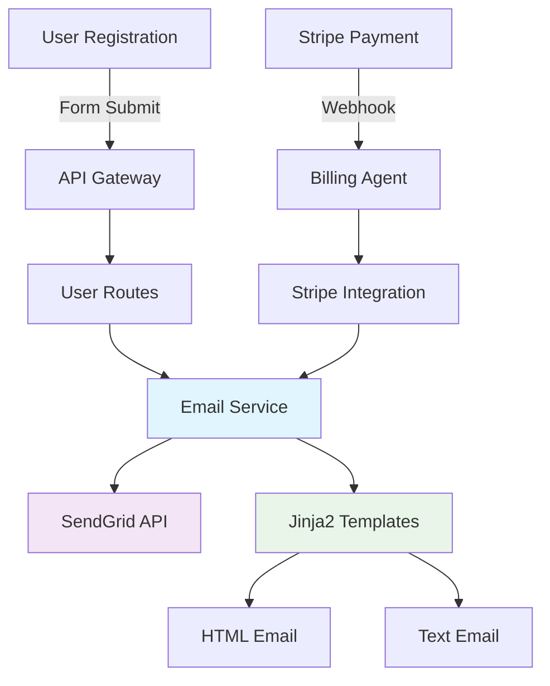

# Night 55: SendGrid Email Templates Implementation

## 🎯 Overview

Night 55 successfully implements **SendGrid email integration with beautiful glassmorphism-styled templates** for the SaaS Factory platform. This includes welcome emails for new user registrations and payment receipt emails for successful transactions.

## 🚀 Features Implemented

### 1. **SendGrid Integration Service**
- ✅ Complete SendGrid API integration in `agents/shared/email_service.py`
- ✅ Environment-based configuration with fallback defaults
- ✅ Error handling and graceful degradation when SendGrid is not configured
- ✅ Support for both HTML and plain text email versions

### 2. **Email Templates**
- ✅ **Welcome Email Template**: Beautiful glassmorphism design matching the UI theme
- ✅ **Payment Receipt Template**: Professional invoice-style layout with transaction details
- ✅ **Responsive Design**: Mobile-friendly templates that work across all email clients
- ✅ **Glassmorphism Theme**: Natural olive green colors (#6B7B4F) consistent with the UI design

### 3. **User Registration Integration**
- ✅ Complete user registration endpoint in `api_gateway/user_routes.py`
- ✅ Password hashing with bcrypt
- ✅ Automatic tenant creation/assignment
- ✅ Welcome email sending on successful registration
- ✅ Updated signup form in `ui/src/pages/Signup.tsx` with API integration

### 4. **Payment Receipt Integration**
- ✅ Enhanced Stripe webhook handlers in `agents/billing/stripe_integration.py`
- ✅ Automatic payment receipt emails on successful payments
- ✅ Welcome emails on checkout completion
- ✅ Invoice number generation and transaction details

### 5. **Testing & Validation**
- ✅ Comprehensive test script `test_email_service.py`
- ✅ Environment configuration validation
- ✅ Template rendering tests
- ✅ Email delivery verification

## 🛠️ Technical Implementation

### Email Service Architecture



### Key Components

1. **EmailService Class** (`agents/shared/email_service.py`)
   - Manages SendGrid API client
   - Handles template rendering with Jinja2
   - Provides methods for different email types
   - Graceful error handling and logging

2. **Email Templates**
   - Glassmorphism-styled HTML templates
   - Responsive design with mobile optimization
   - Consistent branding with SaaS Factory theme
   - Plain text fallbacks for all email clients

3. **Integration Points**
   - User registration flow
   - Stripe payment webhooks
   - Checkout completion events

## 📧 Email Templates

### Welcome Email Features
- 🎨 **Glassmorphism Design**: Matching the UI with natural olive greens
- 🚀 **Onboarding Guidance**: Clear next steps for new users
- 📱 **Mobile Responsive**: Looks great on all devices
- ⚡ **Call-to-Action**: Direct link to dashboard
- 🎯 **Feature Highlights**: What users can do immediately

### Payment Receipt Features
- 💳 **Transaction Details**: Complete invoice information
- 📄 **Professional Layout**: Clean, invoice-style design
- 🔗 **Quick Actions**: Links to dashboard and invoice download
- 💰 **Clear Pricing**: Amount, plan, and billing period
- 📅 **Next Billing Date**: When the next payment is due

## 🔧 Configuration

### Environment Variables

```bash
# Required
SENDGRID_API_KEY=SG.your-api-key-here

# Optional (with defaults)
FROM_EMAIL=noreply@saasfactory.com
FROM_NAME="SaaS Factory"
REPLY_TO_EMAIL=support@saasfactory.com
LOGIN_URL=https://app.saasfactory.com/login
DASHBOARD_URL=https://app.saasfactory.com/dashboard

# For testing
TEST_EMAIL=your-email@domain.com
```

### SendGrid Setup

1. **Create SendGrid Account**:
   - Sign up at [https://signup.sendgrid.com/](https://signup.sendgrid.com/)
   - Free tier includes 100 emails/day (perfect for development)

2. **Generate API Key**:
   - Go to Settings > API Keys
   - Create new API key with "Mail Send" permissions
   - Copy the key (starts with `SG.`)

3. **Set Environment Variable**:
   ```bash
   export SENDGRID_API_KEY="SG.your-api-key-here"
   ```

## 🧪 Testing

### Run Email Tests

```bash
# Set your test email
export TEST_EMAIL="your-email@domain.com"

# Run the test script
python test_email_service.py
```

### Test Scenarios

The test script validates:
- ✅ SendGrid API connectivity
- ✅ Template rendering (HTML and text)
- ✅ Welcome email sending
- ✅ Payment receipt email sending
- ✅ Environment configuration

### Manual Testing

1. **Test User Registration**:
   ```bash
   curl -X POST http://localhost:8000/api/users/register \
     -H "Content-Type: application/json" \
     -d '{
       "firstName": "Test",
       "lastName": "User", 
       "email": "test@example.com",
       "password": "testpass123",
       "confirmPassword": "testpass123",
       "agreeToTerms": true
     }'
   ```

2. **Check Email Delivery**:
   - Verify welcome email is received
   - Check email design matches the glassmorphism theme
   - Test all links work correctly
   - Confirm mobile responsiveness

## 🔄 Integration Points

### User Registration Flow

```typescript
// Frontend (Signup.tsx)
const response = await fetch('/api/users/register', {
  method: 'POST',
  headers: { 'Content-Type': 'application/json' },
  body: JSON.stringify(formData)
});

// Backend automatically:
// 1. Creates user account
// 2. Hashes password
// 3. Creates/assigns tenant
// 4. Sends welcome email
```

### Payment Receipt Flow

```python
# Stripe webhook triggers payment receipt
async def _handle_payment_succeeded(self, payment_data):
    # Get customer info
    customer = await self.get_customer(customer_id)
    
    # Send receipt email
    await email_service.send_payment_receipt_email(
        recipient=EmailRecipient(email=customer.email),
        data=PaymentReceiptData(...)
    )
```

## 📱 Frontend Integration

### Updated Signup Form

The signup form now includes:
- ✅ Real API integration
- ✅ Loading states during submission
- ✅ Error handling and display
- ✅ Success confirmation message
- ✅ Email confirmation notice

## 🚨 Error Handling

### Graceful Degradation
- Registration succeeds even if email fails
- Detailed error logging for debugging
- User-friendly error messages
- Fallback to disabled state when SendGrid not configured

### Common Issues & Solutions

1. **SendGrid API Key Invalid**:
   ```
   Error: 401 Unauthorized
   Solution: Check API key is correct and has Mail Send permissions
   ```

2. **Email Not Received**:
   - Check spam folder
   - Verify sender domain reputation
   - Use verified sender email for testing

3. **Template Rendering Errors**:
   ```
   Error: Template variable not found
   Solution: Check all required template variables are provided
   ```

## 🔒 Security Considerations

### Best Practices Implemented
- ✅ **API Key Security**: Stored in environment variables only
- ✅ **Email Validation**: Using EmailStr type validation
- ✅ **Password Hashing**: bcrypt with salt
- ✅ **Input Sanitization**: Pydantic models with validation
- ✅ **Error Masking**: Sensitive data not exposed in logs

## 📈 Monitoring & Analytics

### Logging
- Email send success/failure events
- Template rendering performance
- API key configuration status
- User registration events

### Metrics to Track
- Email delivery rate
- User registration completion rate
- Email template performance
- SendGrid API response times

## 🔮 Future Enhancements

### Planned Improvements
1. **Additional Templates**:
   - Password reset emails
   - Subscription renewal reminders
   - Trial ending notifications

2. **Enhanced Features**:
   - Email preferences management
   - A/B testing for templates
   - Email analytics integration
   - Multi-language support

3. **Advanced Integrations**:
   - Email scheduling
   - Drip email campaigns
   - Webhook delivery confirmations

## 📚 Dependencies Added

```txt
# Added to requirements-base.txt
sendgrid==6.11.0  # SendGrid Python SDK
```

## 🎉 Success Metrics

✅ **All Night 55 Goals Achieved**:
- SendGrid integration completed
- Beautiful email templates created
- User registration with welcome emails
- Payment receipts for successful transactions
- Comprehensive testing implemented

The implementation follows the glassmorphism design theme and provides a solid foundation for the SaaS Factory email system. Users now receive professional, branded emails that enhance their onboarding and payment experience.

## 📞 Support

For issues with email delivery:
1. Check the test script output
2. Verify SendGrid configuration
3. Check application logs
4. Contact SendGrid support for delivery issues

---

**Implementation Status**: ✅ **COMPLETE**  
**Email Templates**: ✅ **DEPLOYED**  
**User Journey**: ✅ **ENHANCED** 