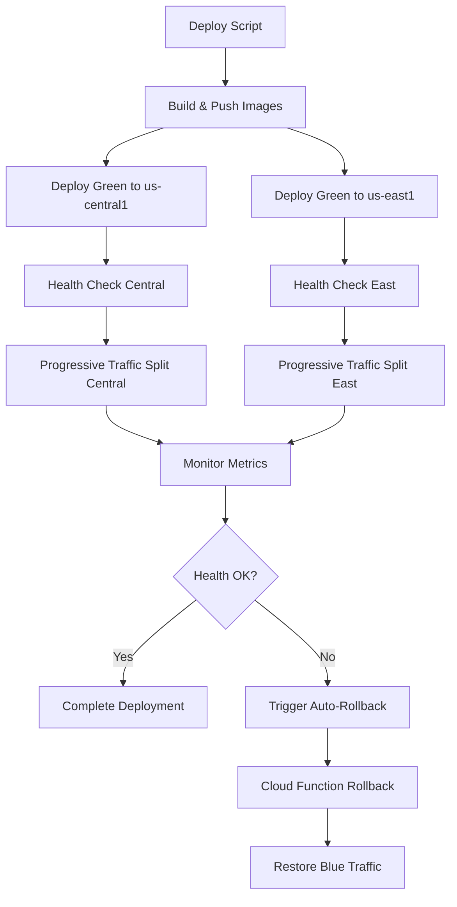

# Night 48 - Multi-Region Blue-Green Deployment System

## Overview

This system implements a comprehensive multi-region blue-green deployment strategy for the SaaS Factory platform, deploying services across `us-central1` and `us-east1` regions with progressive traffic shifting, automated health monitoring, and intelligent rollback capabilities.

## 🏗️ Architecture

### Components

1. **Multi-Region Rollout Script** (`multiregion-rollout.sh`)
   - Orchestrates blue-green deployments across regions
   - Progressive traffic splitting (10% → 25% → 50% → 100%)
   - Automated health checking and rollback
   - Cross-region coordination

2. **Terraform Configuration** (`blue-green-config.tf`)
   - Cloud Monitoring alerts and dashboards
   - SLI/SLO definitions for deployment success
   - Automated rollback Cloud Function
   - Pub/Sub integration for alert-triggered rollbacks

3. **Auto-Rollback Function** (`rollback-function.py`)
   - Cloud Function triggered by monitoring alerts
   - Intelligent service failure detection
   - Automated traffic rollback to stable versions
   - Structured logging and notifications

### Infrastructure Flow



## 🚀 Quick Start

### Prerequisites

1. **Infrastructure Deployed**: Ensure existing Cloud Run services are deployed
2. **Tools Installed**: `gcloud`, `docker`, `terraform`, `jq`, `curl`
3. **Permissions**: Cloud Run Admin, Cloud Monitoring Admin
4. **Project ID**: Update `PROJECT_ID` in scripts if different

### Basic Usage

```bash
# Full blue-green deployment to both regions
cd infra/prod
./multiregion-rollout.sh

# Check infrastructure and tools
./multiregion-rollout.sh check

# Build and push images only
./multiregion-rollout.sh build

# Deploy with blue-green strategy
./multiregion-rollout.sh deploy

# Verify deployment health
./multiregion-rollout.sh verify

# Rollback specific region
./multiregion-rollout.sh rollback us-central1
./multiregion-rollout.sh rollback us-east1

# Cleanup old revisions
./multiregion-rollout.sh cleanup
```

## 📊 Monitoring and Observability

### Dashboards

1. **Blue-Green Deployment Dashboard**
   - Request rate by revision
   - Error rate by revision  
   - Latency percentiles (95th)
   - Traffic split by region

2. **SLI/SLO Tracking**
   - 99% availability during deployments
   - Error budget monitoring
   - Deployment success rate metrics

### Alerts

- **High Error Rate**: Triggers when 5xx errors exceed threshold
- **High Latency**: Alerts on latency spikes > 5 seconds
- **Auto-Rollback Trigger**: Critical issues trigger automated rollback

## 🔄 Traffic Management

### Progressive Traffic Stages

| Stage | Green Traffic | Blue Traffic | Duration | Health Checks |
|-------|---------------|--------------|----------|---------------|
| 1     | 10%          | 90%          | 2 min    | Every 30s     |
| 2     | 25%          | 75%          | 2 min    | Every 30s     |
| 3     | 50%          | 50%          | 2 min    | Every 30s     |
| 4     | 100%         | 0%           | -        | Continuous    |

### Health Check Strategy

- **Initial Health Check**: Before traffic shift
- **Continuous Monitoring**: During each stage
- **Rollback Threshold**: 5 consecutive failures
- **Timeout**: 10 seconds per check
- **Max Attempts**: 10 retries per check

## 🚨 Auto-Rollback System

### Trigger Conditions

- Error rate > 10 requests/5min
- Latency > 5 seconds (95th percentile)
- Health check failures > threshold
- Manual alert escalation

### Rollback Process

1. **Alert Detection**: Cloud Monitoring detects anomaly
2. **Pub/Sub Trigger**: Alert publishes to rollback topic  
3. **Cloud Function**: Processes rollback event
4. **Service Analysis**: Determines affected services
5. **Traffic Shift**: Moves 100% traffic to blue revision
6. **Notification**: Logs structured rollback data

### Recovery Process

```bash
# Check current traffic allocation
gcloud run services describe api-backend \
  --region=us-central1 \
  --format="table(status.traffic[].revisionName,status.traffic[].percent)"

# Manual rollback if needed
./multiregion-rollout.sh rollback us-central1

# Verify rollback success
./multiregion-rollout.sh verify
```

## 🛠️ Configuration

### Environment Variables

```bash
# Core configuration
PROJECT_ID="summer-nexus-463503-e1"
PRIMARY_REGION="us-central1"
SECONDARY_REGION="us-east1"
IMAGE_TAG="20241201-143022"  # Auto-generated timestamp

# Health check configuration  
HEALTH_CHECK_TIMEOUT=300
ROLLBACK_THRESHOLD=5
STAGE_DURATION=120

# Traffic stages
TRAFFIC_STAGES=(10 25 50 100)
```

### Service Configuration

```yaml
# Primary Region Service
service_name: api-backend
region: us-central1
image: us-central1-docker.pkg.dev/PROJECT_ID/saas-factory/api:TAG

# Secondary Region Service  
service_name: api-backend-east
region: us-east1
image: us-central1-docker.pkg.dev/PROJECT_ID/saas-factory/api:TAG
```

## 📝 Deployment Process

### 1. Pre-Deployment Validation

```bash
# Infrastructure check
./multiregion-rollout.sh check

# Service health verification
curl -f https://api-backend-xyz.run.app/health
curl -f https://api-backend-east-xyz.run.app/health
```

### 2. Image Build and Distribution

```bash
# Build container image
docker build -t us-central1-docker.pkg.dev/$PROJECT_ID/saas-factory/api:$TAG .

# Push to Artifact Registry
docker push us-central1-docker.pkg.dev/$PROJECT_ID/saas-factory/api:$TAG
```

### 3. Green Deployment

- Deploy new revision with 0% traffic
- Tag as "green" for identification
- Validate green revision health
- Prepare for traffic migration

### 4. Progressive Traffic Shift

- Start with 10% traffic to green
- Monitor metrics at each stage
- Automatically advance if healthy
- Rollback if issues detected

### 5. Completion and Cleanup

- Promote green to blue tag
- Remove old green tag
- Delete unused revisions (keep 5)
- Update monitoring baselines

## 🧪 Testing

### Smoke Tests

```bash
# Test script functionality
./multiregion-rollout.sh check

# Test health endpoints
curl -f http://LB_IP/health
curl -f https://api-backend-xyz.run.app/health
curl -f https://api-backend-east-xyz.run.app/health
```

### Load Testing

```bash
# Install k6 for load testing
# Generate load during deployment
k6 run --vus 10 --duration 30s load-test.js
```

### Failure Simulation

```bash
# Simulate service failure
gcloud run services update api-backend \
  --region=us-central1 \
  --set-env-vars="SIMULATE_FAILURE=true"

# Verify auto-rollback triggers
./multiregion-rollout.sh verify
```

## 🔧 Troubleshooting

### Common Issues

#### Deployment Stuck at 10% Traffic
```bash
# Check green revision health
curl -f https://GREEN_REVISION_URL/health

# View logs
gcloud logging read "resource.type=cloud_run_revision" --limit=50

# Manual traffic adjustment
gcloud run services update-traffic api-backend \
  --region=us-central1 \
  --to-latest=100
```

#### Rollback Function Not Triggered
```bash
# Check Pub/Sub topic
gcloud pubsub topics list | grep rollback

# View Cloud Function logs
gcloud functions logs read auto-rollback-function --limit=50

# Test alert policy
gcloud alpha monitoring policies list
```

#### Health Checks Failing
```bash
# Check VPC connectivity
gcloud compute networks describe vpc-saas-factory

# Verify service account permissions
gcloud projects get-iam-policy $PROJECT_ID

# Test direct service URL
curl -v https://SERVICE_URL/health
```

### Debug Commands

```bash
# View current traffic allocation
gcloud run services describe api-backend \
  --region=us-central1 \
  --format="value(status.traffic[].percent,status.traffic[].revisionName)"

# Check revision status
gcloud run revisions list \
  --service=api-backend \
  --region=us-central1

# Monitor deployment progress
watch -n 5 "gcloud run services describe api-backend --region=us-central1 --format='table(status.traffic[].revisionName,status.traffic[].percent)'"
```

## 📋 Maintenance

### Regular Tasks

1. **Weekly**: Review deployment metrics and SLO compliance
2. **Monthly**: Clean up old revisions and artifacts
3. **Quarterly**: Update rollback thresholds based on performance data

### Monitoring Checklist

- [ ] Blue-green dashboard accessible
- [ ] Alert policies enabled and configured
- [ ] SLO error budget within limits
- [ ] Auto-rollback function operational
- [ ] Health check endpoints responding
- [ ] Traffic distribution balanced

### Update Procedures

```bash
# Update deployment thresholds
vim multiregion-rollout.sh  # Modify TRAFFIC_STAGES, ROLLBACK_THRESHOLD

# Update monitoring configuration
terraform plan -target=google_monitoring_alert_policy.blue_green_deployment_health
terraform apply

# Test configuration changes
./multiregion-rollout.sh check
```

## 🚦 Best Practices

### Development Workflow

1. **Feature Branches**: Use separate branches for deployment script changes
2. **Testing**: Test scripts in staging environment first
3. **Gradual Rollout**: Start with less critical services
4. **Monitoring**: Always monitor during and after deployments

### Production Deployment

1. **Off-Peak Hours**: Schedule deployments during low traffic
2. **Communication**: Notify team before major deployments
3. **Backup Plan**: Always have rollback strategy ready
4. **Documentation**: Update runbooks after changes

### Security Considerations

1. **Service Accounts**: Use least-privilege IAM roles
2. **Network Security**: Maintain VPC and firewall rules
3. **Secrets Management**: Store sensitive data in Secret Manager
4. **Audit Logging**: Enable and monitor audit logs

## 🔗 Related Resources

- [Cloud Run Documentation](https://cloud.google.com/run/docs)
- [Blue-Green Deployment Patterns](https://cloud.google.com/architecture/application-deployment-and-testing-strategies)
- [Cloud Monitoring Best Practices](https://cloud.google.com/monitoring/best-practices)
- [SLI/SLO Implementation Guide](https://cloud.google.com/blog/products/devops-sre/sre-fundamentals-slis-slas-and-slos)

## 📞 Support

For issues with the blue-green deployment system:

1. Check the troubleshooting section above
2. Review Cloud Logging for error details
3. Verify infrastructure status in Cloud Console
4. Escalate to DevOps team if rollback is needed

---

**Last Updated**: Night 48 Implementation  
**Version**: 1.0.0  
**Maintainer**: SaaS Factory DevOps Team 