# Night 49 - Cost Monitoring & Alert System

## 🎯 Overview

Night 49 implements a comprehensive **intelligent cost monitoring system** for the SaaS Factory platform, featuring automated budget tracking, smart email alerting via SendGrid, and proactive cost optimization recommendations. The system processes billing budget alerts through Pub/Sub and triggers contextual email notifications with actionable insights.

## 🏗️ Architecture

### System Components

```mermaid
graph TD
    A[GCP Billing Budget] -->|Alert Triggered| B[Pub/Sub Topic: cost-guard]
    B --> C[Cost Guard Cloud Function]
    C --> D[Parse Budget Alert]
    D --> E[Analyze Spending Pattern]
    E --> F[Generate Recommendations]
    F --> G[SendGrid Email API]
    G --> H[📧 Stakeholder Notifications]
    
    C --> I[Log Structured Metrics]
    I --> J[Cloud Monitoring]
    J --> K[Cost Dashboard]
    
    C --> L[Secret Manager]
    L --> M[SendGrid API Key]
    
    subgraph "Alerting Thresholds"
        N[50% - Warning]
        O[80% - Critical] 
        P[100% - Emergency]
    end
    
    style C fill:#e1f5fe
    style G fill:#f3e5f5
    style K fill:#e8f5e8
```



### Core Components

1. **CostGuardAgent** (`cost-guard-agent.py`)
   - Python Cloud Function with intelligent alert processing
   - Contextual email generation with severity-based recommendations
   - Structured logging for cost analysis and trends
   - Automated cost optimization suggestions

2. **Enhanced Billing Infrastructure** (`billing.tf`) 
   - Multi-threshold budget alerts (50%, 80%, 100%)
   - Pub/Sub integration for real-time alert processing
   - Secret Manager integration for secure SendGrid API access
   - Custom monitoring metrics for detailed cost tracking

3. **Cost Monitoring Dashboard**
   - Real-time budget utilization visualization
   - Daily spending trends and service-level cost breakdown
   - Actionable cost optimization recommendations
   - Budget forecast and spending pattern analysis

4. **Comprehensive Test Suite** (`test-cost-monitoring.sh`)
   - 15 automated tests covering infrastructure, functionality, and security
   - Mock alert simulation and end-to-end validation
   - IAM permission verification and troubleshooting guides

## 🚀 Quick Start

### Prerequisites

1. **GCP Project Setup**
   - Billing API enabled
   - Cloud Functions API enabled 
   - Secret Manager API enabled
   - Monitoring API enabled

2. **SendGrid Account**
   - Free SendGrid account (up to 100 emails/day)
   - Generated API key with Mail Send permissions

3. **Terraform Environment**
   - Terraform >= 1.0
   - GCP credentials configured

### 1. Configure SendGrid API Key

```bash
# Create SendGrid secret (replace with your actual API key)
echo "SG.YOUR_SENDGRID_API_KEY_HERE" | gcloud secrets create sendgrid-api-key \
  --project=summer-nexus-463503-e1 \
  --data-file=-

# Verify secret creation
gcloud secrets describe sendgrid-api-key --project=summer-nexus-463503-e1
```

### 2. Deploy Infrastructure

```bash
cd infra/prod

# Initialize and plan
terraform init
terraform plan

# Deploy cost monitoring infrastructure
terraform apply

# Verify deployment
terraform output cost_dashboard_url
```

### 3. Test the System

```bash
# Run comprehensive test suite
./test-cost-monitoring.sh

# Manually trigger test alert
gcloud pubsub topics publish cost-guard \
  --message='{"budgetDisplayName":"Test Alert","costAmount":160,"budgetAmount":200}' \
  --project=summer-nexus-463503-e1
```

## 📧 Email Alert System

### Alert Severity Levels

| Threshold | Severity | Notification | Actions |
|-----------|----------|--------------|---------|
| **50%** | 💰 MEDIUM | Email only | Monitor trends, early warning |
| **80%** | ⚠️ HIGH | Email + Slack | Review usage, optimize services |
| **100%** | 🚨 CRITICAL | Email + Slack | Immediate action, scale down |

### Sample Email Content

**Subject**: `🚨 CRITICAL Cost Alert: 85.3% of budget used`

The email includes:
- **Visual Budget Metrics**: Current spend, remaining budget, utilization percentage
- **Contextual Recommendations**: Service-specific optimization tips based on severity
- **Quick Action Links**: Direct links to GCP console and cost dashboard
- **Spending Analysis**: Breakdown by service with trend analysis

### Cost Optimization Recommendations

#### Critical (100%+ spend)
- 🔴 **IMMEDIATE**: Scale down non-essential Cloud Run services
- ⏸️ Reduce Cloud Run max instances to 3-5 per service
- 🗄️ Optimize database connection pooling
- 📊 Enable aggressive auto-scaling policies

#### High (80%+ spend)  
- ⚠️ Review Cloud Run scaling configurations
- 💾 Optimize container images for cold start reduction
- 🔄 Implement aggressive auto-scaling
- 📈 Monitor peak usage patterns

#### Medium (50%+ spend)
- 📊 Monitor spending trends proactively
- ⚡ Code efficiency optimization 
- 🔧 Resource allocation review
- 📱 Consider usage-based pricing

## 📊 Cost Monitoring Dashboard

### Dashboard Widgets

1. **Budget Utilization Gauge**
   - Real-time spending percentage
   - Visual gauge with color-coded thresholds
   - Sparkline trend indicators

2. **Daily Spending Trend**
   - Line chart showing daily cost progression
   - Month-to-date spending visualization
   - Forecasting based on current trends

3. **Cost Breakdown by Service**
   - Stacked area chart by GCP service
   - Identifies highest-cost components
   - Service-level optimization insights

4. **Active Alerts Panel**
   - Current alert status display
   - Alert history and resolution tracking
   - Integration with notification channels

5. **Optimization Recommendations**
   - Static widget with actionable tips
   - Service-specific cost reduction strategies
   - Links to relevant GCP documentation

### Accessing the Dashboard

```bash
# Get dashboard URL
terraform output cost_dashboard_url

# Or navigate manually
https://console.cloud.google.com/monitoring/dashboards?project=summer-nexus-463503-e1
```

## 🔧 Configuration

### Environment Variables

The CostGuardAgent Cloud Function uses these environment variables:

```bash
PROJECT_ID=summer-nexus-463503-e1           # GCP project ID
ALERT_EMAIL=n2nstreams@gmail.com            # Notification recipient
BILLING_ACCOUNT=013356-107066-5683A3        # GCP billing account ID
SENDGRID_API_KEY=<from Secret Manager>      # SendGrid API key (secured)
```

### Budget Configuration

Current budget settings (configurable in `billing.tf`):

```hcl
amount {
  specified_amount {
    currency_code = "USD"
    units         = "200"    # $200/month budget
  }
}

threshold_rules {
  threshold_percent = 0.5    # 50% warning
  threshold_percent = 0.8    # 80% critical  
  threshold_percent = 1.0    # 100% emergency
}
```

### Custom Alert Thresholds

To modify alert thresholds, update `billing.tf`:

```hcl
# Example: Add 25% early warning
threshold_rules {
  threshold_percent = 0.25   # 25% early warning
  spend_basis       = "CURRENT_SPEND"
}
```

## 🧪 Testing & Validation

### Running Tests

```bash
# Full test suite (15 tests)
./test-cost-monitoring.sh

# Individual test categories
./test-cost-monitoring.sh --category infrastructure
./test-cost-monitoring.sh --category functionality
./test-cost-monitoring.sh --category security
```

### Test Categories

| Category | Tests | Coverage |
|----------|-------|----------|
| **Infrastructure** | 8 tests | Terraform state, GCP resources, IAM |
| **Functionality** | 5 tests | Function execution, alerts, monitoring |
| **Security** | 2 tests | Secret access, permissions validation |

### Manual Testing

```bash
# Test budget alert processing
./test-cost-monitoring.sh --test function_execution

# Verify email delivery 
gcloud logging read "resource.type=\"cloud_function\" AND textPayload:\"email sent\"" \
  --limit=5 --project=summer-nexus-463503-e1

# Check function performance
gcloud logging read "resource.type=\"cloud_function\" AND severity>=WARNING" \
  --limit=10 --project=summer-nexus-463503-e1
```

## 🔒 Security & Compliance

### Secret Management

- **SendGrid API Key**: Stored in GCP Secret Manager with IAM access control
- **Service Account**: Least-privilege access with specific role bindings
- **Encryption**: All secrets encrypted at rest and in transit

### IAM Roles

The Cost Guard service account (`cost-guard-sa`) has these roles:

```bash
roles/billing.viewer              # Read billing data
roles/pubsub.subscriber          # Process Pub/Sub messages  
roles/monitoring.metricWriter    # Write custom metrics
roles/secretmanager.secretAccessor # Access SendGrid API key
```

### Data Privacy

- **No PII**: Alert emails contain only aggregated cost data
- **Retention**: Budget alert data retained per GCP default policies
- **Access Control**: Dashboard access limited to project IAM members

## 🚨 Troubleshooting

### Common Issues

#### 1. SendGrid API Key Not Working

```bash
# Verify secret exists
gcloud secrets describe sendgrid-api-key --project=summer-nexus-463503-e1

# Test API key validity
curl -X POST "https://api.sendgrid.com/v3/mail/send" \
  -H "Authorization: Bearer SG.YOUR_API_KEY" \
  -H "Content-Type: application/json" \
  -d '{"personalizations":[{"to":[{"email":"test@example.com"}]}],"from":{"email":"test@example.com"},"subject":"Test","content":[{"type":"text/plain","value":"Test"}]}'
```

#### 2. Cloud Function Not Processing Alerts

```bash
# Check function logs
gcloud logging read "resource.type=\"cloud_function\" AND resource.labels.function_name=\"cost-guard-agent\"" \
  --limit=20 --project=summer-nexus-463503-e1

# Verify Pub/Sub subscription
gcloud pubsub subscriptions describe cost-guard-subscription \
  --project=summer-nexus-463503-e1

# Test function trigger
gcloud functions deploy cost-guard-agent --trigger-topic=cost-guard \
  --runtime=python311 --region=us-central1
```

#### 3. Budget Alerts Not Triggering

```bash
# Check billing budget status
gcloud billing budgets list --billing-account=013356-107066-5683A3

# Verify Pub/Sub topic configuration
gcloud pubsub topics describe cost-guard --project=summer-nexus-463503-e1

# Check billing API permissions
gcloud billing accounts get-iam-policy 013356-107066-5683A3
```

#### 4. Dashboard Not Loading

```bash
# Verify dashboard exists
gcloud monitoring dashboards list --project=summer-nexus-463503-e1 \
  --filter="displayName:'SaaS Factory - Cost Monitoring Dashboard'"

# Check monitoring API
gcloud services list --enabled --filter="name:monitoring.googleapis.com"

# Redeploy dashboard
terraform apply -target=google_monitoring_dashboard.cost_monitoring_dashboard
```

### Error Codes

| Error | Cause | Solution |
|-------|-------|----------|
| `SendGrid 401` | Invalid API key | Update secret in Secret Manager |
| `Budget not found` | Billing permissions | Grant `billing.budgets.view` role |
| `Function timeout` | SendGrid API slow | Increase function timeout to 540s |
| `Pub/Sub 403` | IAM permissions | Grant `pubsub.subscriber` to service account |

## 📈 Monitoring & Maintenance

### Key Metrics to Monitor

1. **Function Execution Rate**
   ```bash
   # Check function invocations
   gcloud logging read "resource.type=\"cloud_function\" AND textPayload:\"Successfully processed\"" \
     --limit=10 --project=summer-nexus-463503-e1
   ```

2. **Email Delivery Success**
   ```bash
   # Check SendGrid responses
   gcloud logging read "resource.type=\"cloud_function\" AND textPayload:\"email sent successfully\"" \
     --limit=10 --project=summer-nexus-463503-e1
   ```

3. **Alert Processing Latency**
   ```bash
   # Monitor function duration
   gcloud logging read "resource.type=\"cloud_function\" AND jsonPayload.executionTimeMs>5000" \
     --limit=5 --project=summer-nexus-463503-e1
   ```

### Regular Maintenance Tasks

#### Weekly
- Review cost trends in dashboard
- Validate alert thresholds against actual usage
- Check function error rates

#### Monthly  
- Rotate SendGrid API key (optional)
- Review and update budget amounts
- Analyze cost optimization effectiveness

#### Quarterly
- Update Cloud Function runtime
- Review IAM permissions
- Conduct disaster recovery testing

## 🔄 Integration with Other Systems

### Slack Integration

To add Slack notifications, update notification channels:

```hcl
notification_channels = [
  google_monitoring_notification_channel.slack.id,
  google_monitoring_notification_channel.email.id
]
```

### External Monitoring Systems

The CostGuardAgent can integrate with external systems:

```python
# Add to cost-guard-agent.py
def send_to_external_system(alert: BudgetAlert):
    """Send cost data to external monitoring system"""
    webhook_url = os.environ.get('EXTERNAL_WEBHOOK_URL')
    if webhook_url:
        payload = {
            'alert_type': 'cost_threshold',
            'severity': alert.severity,
            'spending_percentage': alert.spending_percentage,
            'project_id': alert.project_id
        }
        requests.post(webhook_url, json=payload)
```

### Cloud Run Auto-Scaling

For automatic cost reduction, integrate with Cloud Run Admin API:

```python
def auto_scale_services(alert: BudgetAlert):
    """Automatically scale down services when budget is exceeded"""
    if alert.severity == "CRITICAL":
        from google.cloud import run_v2
        
        client = run_v2.ServicesClient()
        # Reduce max instances for all services
        # Implementation details in cost-guard-agent.py
```

## 📚 Additional Resources

### GCP Documentation
- [Cloud Billing Budgets](https://cloud.google.com/billing/docs/how-to/budgets)
- [Cloud Functions Python](https://cloud.google.com/functions/docs/writing/write-python-functions)
- [Secret Manager Best Practices](https://cloud.google.com/secret-manager/docs/best-practices)

### SendGrid Documentation  
- [SendGrid API Documentation](https://docs.sendgrid.com/api-reference)
- [Python SendGrid Library](https://github.com/sendgrid/sendgrid-python)

### Cost Optimization Guides
- [GCP Cost Optimization](https://cloud.google.com/docs/cost-optimization)
- [Cloud Run Cost Optimization](https://cloud.google.com/run/docs/tips/general)

## 🎉 Success Metrics

### Night 49 Completion Criteria

- ✅ **CostGuardAgent Deployed**: Cloud Function processing budget alerts
- ✅ **Email Integration**: SendGrid API configured and tested
- ✅ **Multi-Threshold Alerts**: 50%, 80%, 100% alert policies active
- ✅ **Cost Dashboard**: Real-time cost monitoring and visualization  
- ✅ **Comprehensive Testing**: 15 automated tests covering all components
- ✅ **Documentation**: Complete operational and troubleshooting guide

### Key Performance Indicators

| Metric | Target | Current |
|--------|---------|---------|
| **Alert Latency** | < 5 minutes | TBD |
| **Email Delivery Rate** | > 99% | TBD |
| **Function Success Rate** | > 99.9% | TBD |
| **Cost Prediction Accuracy** | > 90% | TBD |

---

**🎊 Night 49 Achievement Unlocked!** 

Your SaaS Factory now has intelligent cost monitoring with automated email alerts, comprehensive dashboards, and proactive optimization recommendations. The system will help you stay within budget while maximizing the value of your cloud infrastructure investment.

**Next Steps**: Monitor the dashboard daily, review weekly cost trends, and adjust budget thresholds as your platform scales. 